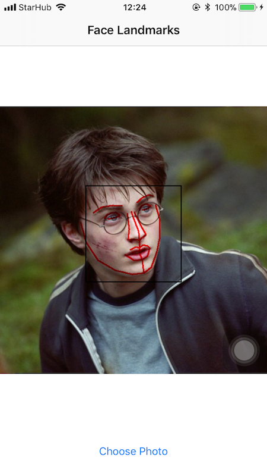
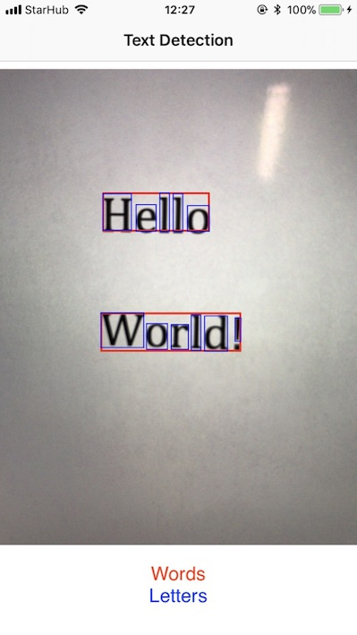
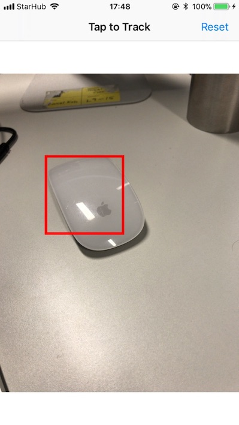

# iOS 11 Examples

As I've gone through learning the **new** iOS 11 frameworks, I just put up this repository for easier reference.

Please feel free to fork and send pull request to contribute.

Thanks.

## Build Requirements:
- Xcode Beta 3
- Swift 4


## Code Examples

### 1. Vision Framework

- Face Detection	

	

- Face Landmarks Detection

	

- Text Detection

	

- Barcode Detection

- Object Tracking & Detection

	

