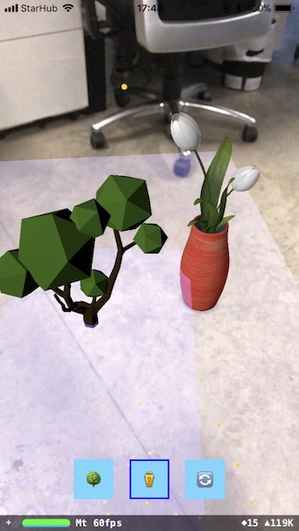
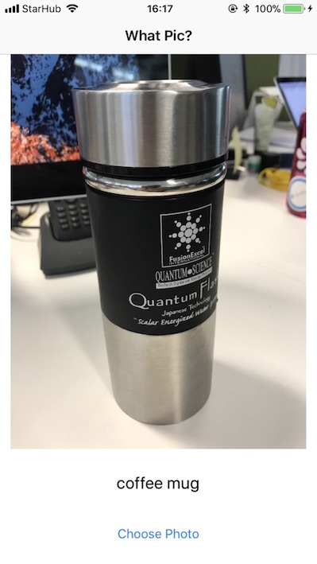

# iOS 11 Examples

As I've gone through learning the **new** iOS 11 frameworks, I just put up this repository for easier reference.

Please feel free to fork and send pull request to contribute.

Thanks.

## Build Requirements:
- Xcode 9 Beta 2
- Swift 4
- iOS 11


## Code Examples

### 1. Vision Framework

- Face Detection	

	

- Face Landmarks Detection

	

- Text Detection

	

- Barcode Detection

- Object Tracking & Detection

	

**Useful Links:**

**Apple Vision Documentation**

<https://developer.apple.com/documentation/vision>

**WWDC 2017 Session**

<https://developer.apple.com/videos/play/wwdc2017/506/>

### 2. ARKit

**Useful Links:**

**Apple ARKit Documentation**

<https://developer.apple.com/documentation/arkit>

**WWDC 2017 Session**

<https://developer.apple.com/videos/play/wwdc2017/602/>

### 3. CoreML

This demo is using the Inception v3 trained model.
You can download the model [here](https://developer.apple.com/machine-learning/).

**Useful Links:**

**Apple CoreML Documentation:**
<https://developer.apple.com/documentation/coreml>
<https://developer.apple.com/machine-learning/>

**WWDC 2017 Session**

Intro to CoreML:
<https://developer.apple.com/videos/play/wwdc2017/703/>

CoreML in Depth:
<https://developer.apple.com/videos/play/wwdc2017/710/>
